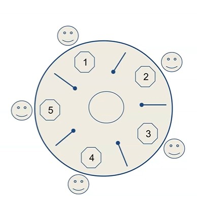

---

# 🍝 Dining Philosophers Problem — Notes with Java Code & Output

## 1. Problem Statement (Classical Concurrency Problem)

* **Five philosophers** sit around a circular table.
* **Five forks** are placed between each pair of philosophers.
* Each philosopher alternates between:

  * **Thinking**
  * **Eating**
* To eat, a philosopher **must hold both left and right forks**.
* Each fork can be held by **only one philosopher at a time**.
* Goal:
  👉 **Design a concurrent algorithm where no philosopher starves or deadlocks**.

---

## 2. Key Concurrency Challenges

### ❌ Deadlock

All philosophers pick up one fork and wait forever for the second.

### ❌ Starvation

Some philosophers never get a chance to eat due to unfair scheduling.

### ✅ Desired Properties

* **Mutual Exclusion** – Fork used by only one philosopher.
* **No Deadlock**
* **No Starvation**
* **Fairness**

---

## 3. Approach 1: Using `ReentrantLock` (Lock-based Solution)

### 🔹 Concept

* Each fork is represented by a `ReentrantLock`.
* Philosopher locks two forks before eating.
* Explicit `lock()` and `unlock()` control.

### 🔹 Code Snippet

```java
import java.util.concurrent.locks.Lock;
import java.util.concurrent.locks.ReentrantLock;

public class DiningPhilosophers {

    static Lock spoon1 = new ReentrantLock(); 
    static Lock spoon2 = new ReentrantLock(); 
    static Lock spoon3 = new ReentrantLock(); 
    static Lock spoon4 = new ReentrantLock(); 
    static Lock spoon5 = new ReentrantLock(); 
    
    public static void main(String[] args) {

        new Thread(() -> {
            spoon2.lock();
            spoon1.lock();
            System.out.println("Philosopher 1 is eating");
            spoon1.unlock();
            spoon2.unlock();
        }).start();

        new Thread(() -> {
            spoon3.lock();
            spoon2.lock();
            System.out.println("Philosopher 2 is eating");
            spoon2.unlock();
            spoon3.unlock();
        }).start();

        new Thread(() -> {
            spoon4.lock();
            spoon3.lock();
            System.out.println("Philosopher 3 is eating");
            spoon3.unlock();
            spoon4.unlock();
        }).start();

        new Thread(() -> {
            spoon5.lock();
            spoon4.lock();
            System.out.println("Philosopher 4 is eating");
            spoon4.unlock();
            spoon5.unlock();
        }).start();

        new Thread(() -> {
            spoon1.lock();
            spoon5.lock();
            System.out.println("Philosopher 5 is eating");
            spoon5.unlock();
            spoon1.unlock();
        }).start();
    }
}
```

### 🔹 Sample Output

```
Philosopher 1 is eating
Philosopher 3 is eating
Philosopher 5 is eating
Philosopher 2 is eating
Philosopher 4 is eating
```

> ⚠️ **Issue:**
> If all philosophers lock their first fork simultaneously, this approach **can deadlock**. There is **no starvation prevention**.

---

## 4. Approach 2: Using `synchronized` Blocks (Monitor-based Solution)

### 🔹 Concept

* Forks are plain `Object` instances.
* Java’s intrinsic lock (`synchronized`) ensures mutual exclusion.
* Each philosopher:

  1. Thinks
  2. Picks left fork
  3. Picks right fork
  4. Eats
  5. Releases both forks

---

### 🔹 Main Class

```java
public class DiningPhilosophersSynchronized {

    public static void main(String[] args) {
        Philosopher[] philosophers = new Philosopher[5];
        Object[] forks = new Object[5];

        for (int i = 0; i < forks.length; i++) {
            forks[i] = new Object();
        }

        for (int i = 0; i < philosophers.length; i++) {
            Object leftFork = forks[i];
            Object rightFork = forks[(i + 1) % forks.length];

            philosophers[i] = new Philosopher(leftFork, rightFork);
            new Thread(philosophers[i], "Philosopher " + (i + 1)).start();
        }
    }
}
```

---

### 🔹 Philosopher Class

```java
class Philosopher implements Runnable {

    private Object leftFork;
    private Object rightFork;

    public Philosopher(Object leftFork, Object rightFork) {
        this.leftFork = leftFork;
        this.rightFork = rightFork;
    }

    @Override
    public void run() {
        while (true) {
            doWork("Thinking");

            synchronized (leftFork) {
                doWork("Picked up left fork");

                synchronized (rightFork) {
                    doWork("Picked up right fork and eating");
                }

                doWork("Put down right fork");
            }
            doWork("Put down left fork and back to thinking");
        }
    }

    private void doWork(String action) {
        System.out.println(Thread.currentThread().getName() + " " + action);
        try {
            Thread.sleep((int) (Math.random() * 100));
        } catch (InterruptedException e) {
            e.printStackTrace();
        }
    }
}
```

---

### 🔹 Sample Output

```
Philosopher 1 Thinking
Philosopher 1 Picked up left fork
Philosopher 1 Picked up right fork and eating
Philosopher 1 Put down right fork
Philosopher 1 Put down left fork and back to thinking
Philosopher 3 Picked up left fork
Philosopher 3 Picked up right fork and eating
```

---

## 5. Problems in the Synchronized Approach

### ❌ Deadlock Possibility

All philosophers:

```
lock(leftFork) → wait forever for rightFork
```

### ❌ No Fairness Guarantee

* JVM scheduling may cause **starvation**.

---

## 6. How to Prevent Deadlock & Starvation (Theory)

### ✅ Common Solutions

1. **Resource Ordering**

   * Always pick the lower-numbered fork first.
2. **Odd–Even Strategy**

   * Odd philosophers pick left first.
   * Even philosophers pick right first.
3. **Semaphore / Waiter (Butler)**

   * Allow only `N-1` philosophers to eat at once.
4. **TryLock with Timeout**

   * Release fork if second fork isn’t available.

---

## 7. Interview One-Liner Explanation

> “Dining Philosophers is a classic synchronization problem demonstrating deadlock and starvation. It requires careful ordering or coordination of resource acquisition to ensure mutual exclusion, progress, and fairness.”

---
